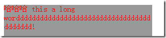
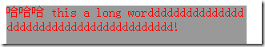

# 文本效果

## word-wrap

```css
word-wrap: normal|break-word;
```

| 值         | 描述                                       |
| :--------- | :----------------------------------------- |
| normal     | 只在允许的断字点换行（浏览器保持默认处理） |
| break-word | 在长单词或 URL 地址内部进行换行            |

## word-break

```css
word-break: normal|break-all|keep-all;
```

| 值        | 描述                         |
| :-------- | :--------------------------- |
| normal    | 使用浏览器默认的换行规则     |
| break-all | 允许在单词内换行             |
| keep-all  | 只能在半角空格或连字符处换行 |

## word-break 和 word-wrap 换行的区别

word-wrap



word-break




