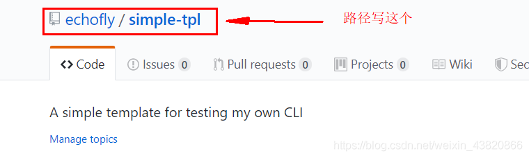

# Cli

## 教程

### 初始化目录

创建文件夹，并取名 qwe-demo-cli，同时 `npm init -y`

配置 package.json，并 `npm install`

```json
  "dependencies": {
    "chalk": "^2.4.2", // 给终端的字体加上颜色，更加炫酷
    "commander": "^2.19.0", // 一个命令行框架，用来解析用户命令行输入和参数
    "download-git-repo": "^1.1.0", // 下载并提取 Git 仓库，主要用来下载项目模板
    "inquirer": "^6.2.2", // 一个交互式命令行工具，像 vue-cli3 中那样在命令行中和用户交互
    "ora": "^3.2.0" // 在终端上显示一些小图标（loading、succeed、warn 等）
  },
  "bin": { // 用于绑定全局指令
    "qwe": "bin/qwe.js",
    "qwe-add": "bin/qwe-add.js",
    "qwe-delete": "bin/qwe-delete.js",
    "qwe-list": "bin/qwe-list.js",
    "qwe-init": "bin/qwe-init.js"
  },
```

其他

- handlebars.js：一个模板引擎，用来将用户提交的信息动态填充到文件中
- log-symbols：在终端上显示出 √ 或 × 等的图标

根目录新建一个 `template.json` 文件，里面的内容就是一个 `{}`，该文件主要用于存储你的模板的 git 地址的

### 绑定全局

在根目录下执行 `npm link`（就是把命令挂载到全局的意思），这样我们每次只要输入`qwe / qwe add / qwe delete / qwe list / qwe init`，就可以直接运行了

```bash
npm link # 全局绑定
npm unlink # 全局解绑
```

### bin 目录初始化

qwe.js（对应 `qwe` 指令）

```js
#!/usr/bin/env node

const program = require('commander')

// 定义当前版本
// 定义使用方法
// 定义四个指令
program
  .version(require('../package').version)
  .usage('<command> [options]')
  .command('add', 'add a new template')
  .command('delete', 'delete a template')
  .command('list', 'list all the templates')
  .command('init', 'generate a new project from a template')
  
// 解析命令行参数
program.parse(process.argv)
```

> 开头的 `#!/usr/bin/env node` 语句必须加上，主要是为了让系统看到这一行时，会沿着该路径去查找 node 并执行，主要是为了兼容 Mac ，确保可执行

qwe-add.js（对应 `qwe add` 指令）

```js
#!/usr/bin/env node

// 交互式命令行
const inquirer = require('inquirer')
// 修改控制台字符串的样式
const chalk = require('chalk')
// node 内置文件模块
const fs = require('fs')
// 读取根目录下的 template.json
const tplObj = require(`${__dirname}/../template`)

// 自定义交互式命令行的问题及简单的校验
let question = [
  {
    name: "name",
    type: 'input',
    message: "请输入模板名称",
    validate (val) {
      if (val === '') {
        return 'Name is required!'
      } else if (tplObj[val]) {
        return 'Template has already existed!'
      } else {
        return true
      }
    }
  },
  {
    name: "url",
    type: 'input',
    message: "请输入模板地址",
    validate (val) {
      if (val === '') return 'The url is required!'
      return true
    }
  }
]

inquirer
  .prompt(question).then(answers => {
    // answers 就是用户输入的内容，是个对象
    let { name, url } = answers;
    // 过滤 unicode 字符
    tplObj[name] = url.replace(/[\u0000-\u0019]/g, '')
    // 把模板信息写入 template.json 文件中
    fs.writeFile(`${__dirname}/../template.json`, JSON.stringify(tplObj), 'utf-8', err => {
      if (err) console.log(err)
      console.log('\n')
      console.log(chalk.green('Added successfully!\n'))
      console.log(chalk.grey('The latest template list is: \n'))
      console.log(tplObj)
      console.log('\n')
    })
  })
```

> 模板地址 url 的路径
>
> 

qwe-delete.js（对应 `qwe delete` 指令）

```js
#!/usr/bin/env node

const inquirer = require('inquirer')
const chalk = require('chalk')
const fs = require('fs')
const tplObj = require(`${__dirname}/../template`)

let question = [
  {
    name: "name",
    message: "请输入要删除的模板名称",
    validate (val) {
      if (val === '') {
        return 'Name is required!'
      } else if (!tplObj[val]) {
        return 'Template does not exist!'
      } else  {
        return true
      }
    }
  }
]

inquirer
  .prompt(question).then(answers => {
    let { name } = answers;
    delete tplObj[name]
    // 更新 template.json 文件
    fs.writeFile(`${__dirname}/../template.json`, JSON.stringify(tplObj), 'utf-8', err => {
      if (err) console.log(err)
      console.log('\n')
      console.log(chalk.green('Deleted successfully!\n'))
      console.log(chalk.grey('The latest template list is: \n'))
      console.log(tplObj)
      console.log('\n')
    })
  })
```

qwe-list.js（对应 `qwe list` 指令）

```js
#!/usr/bin/env node

const tplObj = require(`${__dirname}/../template`)
console.log(tplObj)
```

qwe-init.js（对应 `qwe init` 指令）

```js
#!/usr/bin/env node

const program = require('commander')
const chalk = require('chalk')
const ora = require('ora')
const download = require('download-git-repo')
const tplObj = require(`${__dirname}/../template`)

program
  .usage('<template-name> [project-name]')
program.parse(process.argv)
// 当没有输入参数的时候给个提示
if (program.args.length < 1) return program.help()

// 好比 vue init webpack project-name 的命令一样，第一个参数是 webpack，第二个参数是 project-name
let templateName = program.args[0]
let projectName = program.args[1]
// 小小校验一下参数
if (!tplObj[templateName]) {
  console.log(chalk.red('\n Template does not exit! \n '))
  return
}
if (!projectName) {
  console.log(chalk.red('\n Project should not be empty! \n '))
  return
}

url = tplObj[templateName]

console.log(chalk.white('\n Start generating... \n'))
// 出现加载图标
const spinner = ora("Downloading...");
spinner.start();
// 执行下载方法并传入参数
download (
  url,
  projectName,
  err => {
    if (err) {
      spinner.fail();
      console.log(chalk.red(`Generation failed. ${err}`))
      return
    }
    // 结束加载图标
    spinner.succeed();
    console.log(chalk.green('\n Generation completed!'))
    console.log('\n To get started')
    console.log(`\n    cd ${projectName} \n`)
  }
)
```

### 鸣谢

[仿 vue-cli 搭建一个自己的脚手架_Hello博客-CSDN博客](https://blog.csdn.net/weixin_43820866/article/details/102768255)

## 自研

champion.js

```js
#!/usr/bin/env node
const program = require('commander')
const download = require('download-git-repo')

program
    .version(require('../package.json').version)
    .usage('<command> [options]')

program
    .command('create <app-name>')
    .description('create a new project')
    .action((appName) => {
        download('general-guan/website', appName, (err) => {
            if (err) {
                console.log('下载失败');
                return
            }
            console.log('下载成功');
        })

    })


program.parse(process.argv)
```

