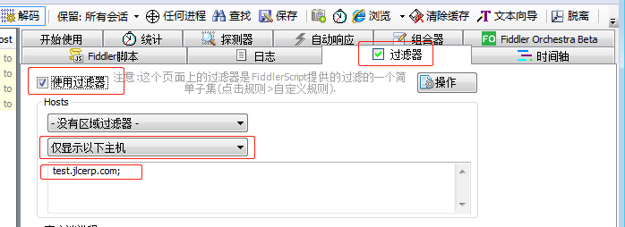

# Fiddler

[Fiddler中文版下载|Fiddler(HTTP调试抓包工具) V5.2汉化版下载-Win7系统之家](http://www.winwin7.com/soft/13111.html)

## 过滤器配置

每次使用Fiddler，打开一个网站，都能在Fiddler中看到几十个会话，看得眼花缭乱

我们可以使用过滤器过滤掉我们不需要的会话

## 快捷键

| 指令     | 作用     |
| -------- | -------- |
| Ctrl + x | 清空会话 |

## 参考文献

[fiddler几种功能强大的用法（一） - 秋水潺流 - 博客园](https://www.cnblogs.com/chenshaoping/p/5785010.html)

[用Fiddler模拟低速网络环境-前端开发博客](http://caibaojian.com/fiddler.html)

[fiddler配置及使用教程 - purplelavender - 博客园](https://www.cnblogs.com/woaixuexi9999/p/9247705.html)

