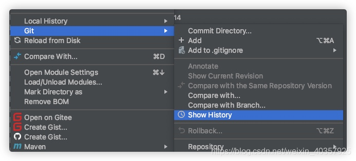
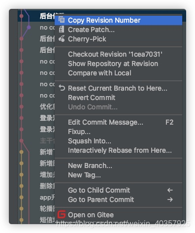

# Git

## IDEA 中使用 git 回退单个文件的版本

1. 在要回退的文件右键查看历史版本



2. 找到要回退的版本复制版本号



3. 在文件目录里打开终端（Terminal），并输入命令，就能看到文件退回到指定版本了


   ```bash
   git checkout <git版本号> <文件名>
   ```

4. 记得 commit push

## Git 中的 `core.autocrlf` 选项

项目的开发环境为 Windows，在 Linux 环境下编译，使用 Git 进行版本控制

在安装好 Git 和 TortoiseGit 后，从远端 `clone`，遇到一个奇怪的问题，Shell 脚本中的 `LF` 总是被替换成了 `CRLF`，最后发现是在 Git 的安装过程中有一项没有被配置好

在 Windows下，由回车 `CR`（\r）和换行 `LF`（\n）共同标志一行的结束

而在 Linux 和 Mac 环境下，每一行的结束仅有一个换行 `LF`（\n）

在 Git 中有一项 `core.autocflf` 配置项，它可以被配置为 `true`，`false` 和 `input`，它们分别表示：

```bash
# 提交时转换为LF，检出时转换为CRLF
git config --global core.autocrlf true

# 提交时转换为LF，检出时不转换
git config --global core.autocrlf input

# 提交检出均不转换
git config --global core.autocrlf false
```

 使用上述的最后一条命令，将 `core.autocrlf` 配置为 `false`，即不开启自动转换功能，之后重新 `clone`，本地仓库中的 Shell 脚本中不再出现 `CR`