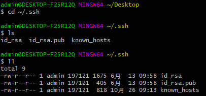
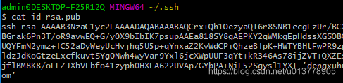
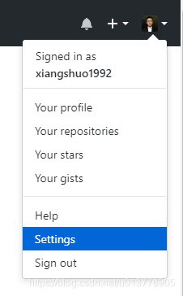
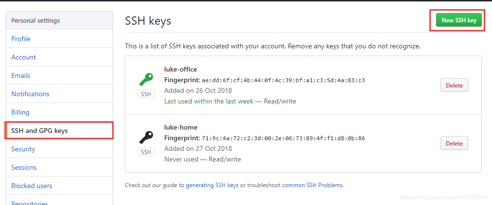

# SSH

```
https://github.com/xiangshuo1992/preload.git
git@github.com:xiangshuo1992/preload.git
```

这两个地址展示的是同一个项目，但是这两个地址之间有什么联系呢？

前者是 https url 直接有效网址打开，但是用户每次通过 git 提交的时候都要输入用户名和密码，有没有简单的一点的办法，一次配置，永久使用呢？当然，所以有了第二种地址，也就是 SSH url，那如何配置就是本文要分享的内容

**GitHub 配置SSH Key 的目的是为了帮助我们在通过git提交代码是，不需要繁琐的验证过程，简化操作流程**

## 设置 git 的 user name 和 email

如果你是第一次使用，或者还没有配置过的话需要操作一下命令，自行替换相应字段

```bash
git config --global user.name "Luke.Deng"
git config --global user.email  "xiangshuo1992@gmail.com"
```

## 检查是否存在 SSH Key

```bash
cd ~/.ssh
ls 或 ll
# 看是否存在 id_rsa 和 id_rsa.pub 文件，如果存在，说明已经有 SSH Key
```

如下图



如果没有SSH Key，则需要先生成一下

```bash
ssh-keygen -t rsa -C "xiangshuo1992@gmail.com"
```

之后直接回车，不用填写东西，之后会让你输入密码（可以不输入密码，直接为空，这样更新代码不用每次输入 id_rsa 密码了），然后就生成一个目录 .ssh ，里面有两个文件：id_rsa , id_rsa.pub（id_rsa 中保存的是私钥，id_rsa.pub 中保存的是公钥）

## 获取 SSH Key

```bash
cat id_rsa.pub
# 拷贝秘钥 ssh-rsa开头
```

如下图



## GitHub 添加 SSH Key

GitHub 点击用户头像，选择 setting



新建一个SSH Key

