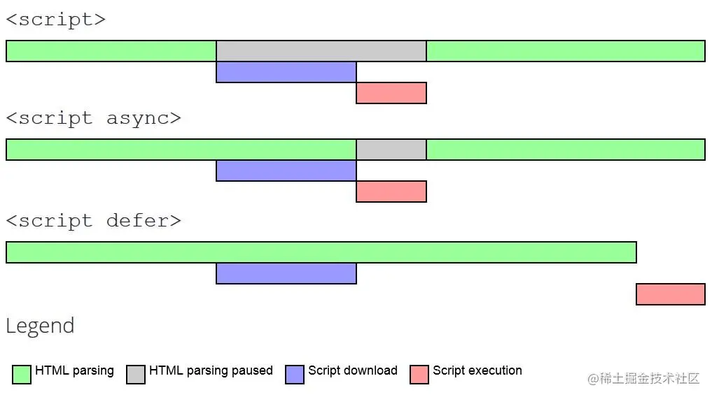

# HTML 面试题

https://juejin.cn/post/7061588533214969892#heading-15

## 如何理解 HTML 语义化

- 让人更容易读懂（增加代码可读性）
- 让搜索引擎更容易读懂，有助于爬虫抓取更多的有效信息，爬虫依赖于标签来确定上下文和各个关键字的权重（SEO）
- 在没有 CSS 样式下，页面也能呈现出很好地内容结构、代码结构

## script 标签中 defer 和 async 的区别

https://juejin.cn/post/6894629999215640583

`script` ：会阻碍 HTML 解析，只有下载好并执行完脚本才会继续解析 HTML

`async script` ：解析 HTML 过程中进行脚本的异步下载，下载成功立马执行，有可能会阻断 HTML 的解析

`defer script`：完全不会阻碍 HTML 的解析，解析完成之后再按照顺序执行脚本

下图清晰地展示了三种 `script` 的过程： 

## 从浏览器地址栏输入 url 到请求返回发生了什么

https://juejin.cn/post/6844903784229896199

https://juejin.cn/post/6935232082482298911

https://juejin.cn/post/6990344840181940261
