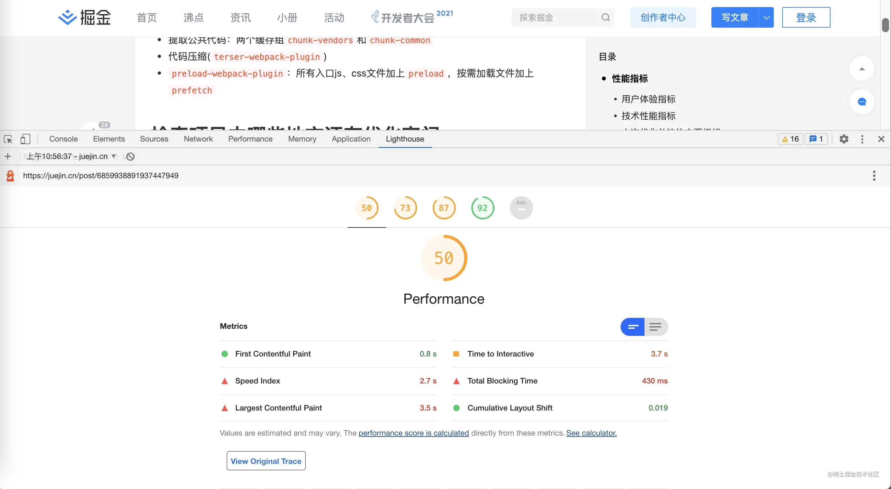

# 性能优化

## 如何量化网站是否需要做性能优化？

使用 chrome 自带的 Lighthouse 工具进行分析，得出的分数会列举出三个档次，然后再根据提出不同建议进行优化

例如：打开掘金的页面，然后点开开发者工具中的 Lighthouse 插件

我们可以看到几项指标：

- First Contentful Paint 首屏加载时间(FCP)
- Time to interactive 可互动的时间(TTI) `衡量一个页面多长时间才能完全交互`
- Speed Index 内容明显填充的速度(SI) `分数越低越好`
- Total Blocking Time 总阻塞时间(TBT) `主线程运行超过50ms的任务叫做Long Task，Total Blocking Time (TBT) 是 Long Tasks（所有超过 50ms 的任务）阻塞主线程并影响页面可用性的时间量，比如异步任务过长就会导致阻塞主线程渲染，这时就需要处理这部分任务`
- Largest Contentful Paint 最大视觉元素加载的时间(LCP) `对于SEO来说最重要的指标,用户如果打开页面很久都不能看清楚完整页面，那么SEO就会很低。（对于Google来说）`
- Cumulative Layout Shift 累计布局偏移(CLS) `衡量页面点击某些内容位置发生偏移后对页面对影响 eg:当图片宽高不确定时会时该指标更高，还比如异步或者dom动态加载到现有内容上的情况也会造成CLS升高`

以上的6个指标就能很好的量化我们网页的性能，得出类似以下结论，并采取措施

- 比如打包体积 （webpack 优化，tree-sharking 和按需加载插件，以及 css 合并）
- 图片加载大小优化（使用可压缩图片，搭配上懒加载和预加载）
- http1.0 替换为 http2.0 后可使用二进制标头和多路复用（某些图片使用 cdn 请求时使用了 http1.0）
- 图片没有加上 width 和 heigth（或者说没有父容器限制），当页面重绘重排时容易造成页面排版混乱的情况
- 避免巨大的网络负载，比如图片的同时请求和减少同时请求的数量
- 静态资源缓存
- 减少未使用的 JavaScript 并推迟加载脚本（defer 和 async）

## 如何做性能优化

Vue-cli 已经做了的优化：

- 使用 cache-loader 默认为 Vue/Babel/TypeScript 编译开启，文件会缓存在 node_modules/.cache 里
- 图片小于 4k 的会转为 base64 储存在 js 文件中
- 生产环境会将 css 提取成单独的文件
- 提取公共代码
- 代码压缩
- 给所有的 js 文件和 css 文件加上 preload

我们需要做的优化：（`根据分析工具得出后，对应自己的项目进行细化而来`）

