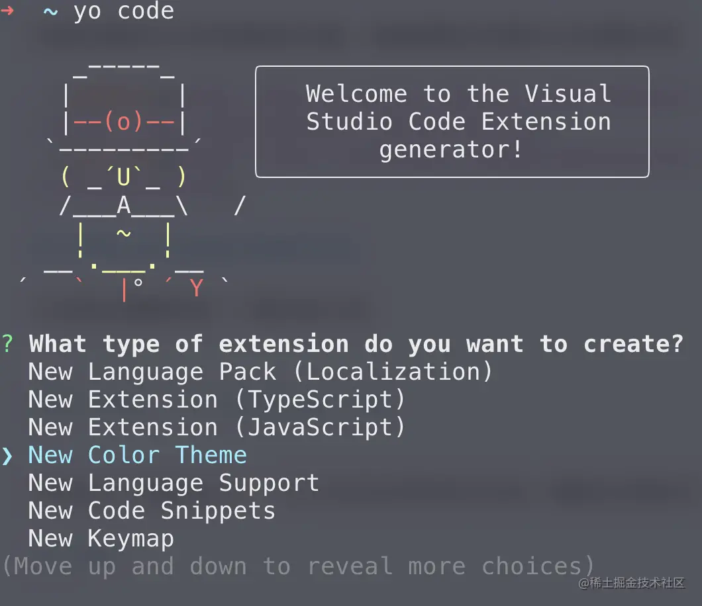
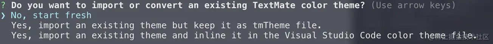
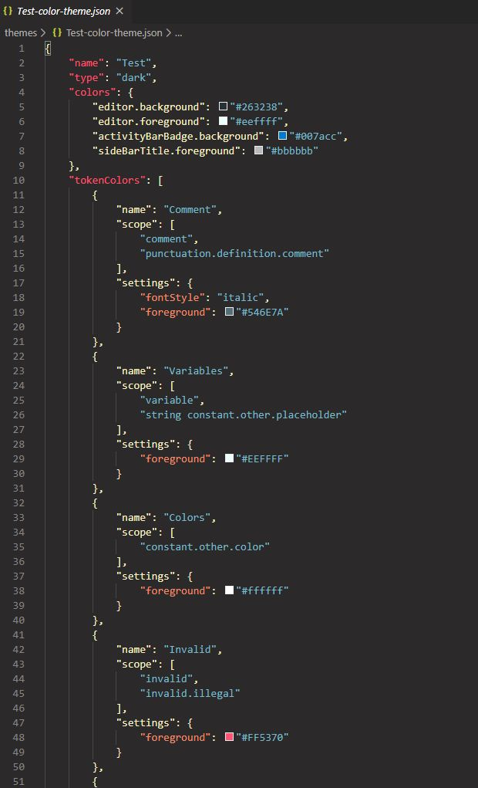
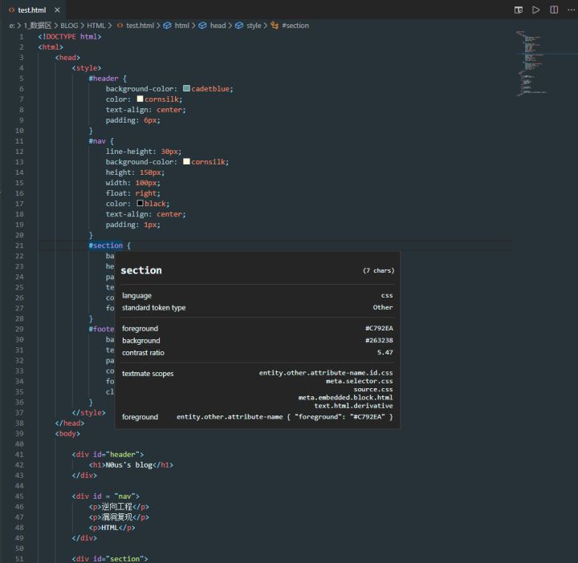
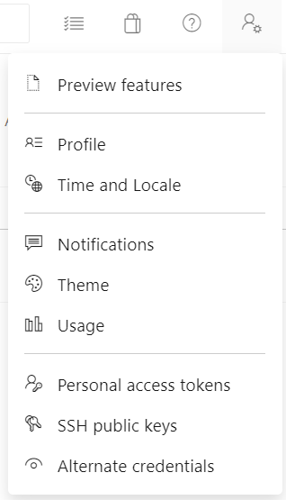
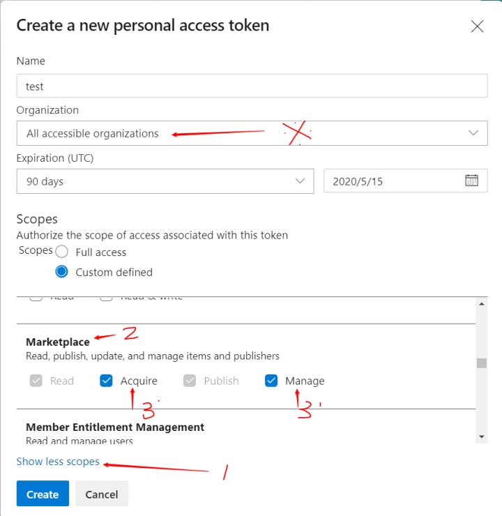

# 如何打造一款自己的 VSCode 主题？

## 主题开发

### 安装扩展生成器

首先全局安装脚手架工具

```bash
npm install -g yo generator-code
```

然后在指定目录运行下面的命令

```bash
yo code
```



我们要开发一个主题，所以选中 New Color Theme，之后会继续询问你是否新建主题还是从现有主题导入，我们这里选创建一个全新的



之后还会问你一些问题：

- 插件名字
- 标识符（插件商店显示名称）
- 描述（这个后面可以在 package.json 里面改）
- 发布者的名字
- 对于用户这个插件的名字
- 这个主题是 `dark` 还是 `light` 还是高对比度

### 配置主题

根据提示，先输入 `cd test（这里你的文件名）`，目录树如下：

```
│  .vscodeignore
│  CHANGELOG.md
│  package.json
│  README.md
│  vsc-extension-quickstart.md
│
├─.vscode
│      launch.json
│
└─themes
        Test-color-theme.json
```

这里我们需要配置的是 themes 目录下的 Test-color-theme.json 文件，打开：



这里的每一个配置项对应的是 vscode 编辑器的一个个 scope，比方说 Comment 对应的是你注释的颜色，你可以根据自己的设计方法配置，但问题来了，难道我们只能在这里配置而不能实时的一遍配置一遍看效果吗，当然不会，你只需要 `F5` 开始调试，然后，即可打开一个新的处于调试模式下的 vscode 窗口

打开之后，使用 `Ctrl+Shift+P` 进入 vscode 的命令窗口，输入 `Developer:Inspect Editor Tokens and Scopes` 进入开发者模式，检查编辑器和标记作用域模式，这时候你会发现点击你调试窗口中你想修改的部分，会出现相关的 scope 信息



## 主题发布

首先全局安装 vsce :

```bash
npm install -g vsce
```

之后你需要去注册一个账号，网址在这：[Azure DevOps Services | Microsoft Azure](https://azure.microsoft.com/zh-cn/services/devops/)

完成之后，点击你的个人设置，选择 `Personal Access Tokens`



进入之后新建一个 Token，Name 写你的 id 即可，注意 Organization 一定要如图选，不然一会可能会连不上，然后点击图中 1 处，找到 MarketPlace 项如图配置



点击 Create，他会给你一个 Token，复制并保存下来，这是唯一保存的机会

现在你可以通过下面这个命令来登陆：

```bash
# vsce login （发布者的名字）
vsce login general-guan
```

然后直接使用以下命令即可发布：

```bash
vsce publish
```

再过几分钟就可以在扩展商店搜索到自己的插件了

## 参考地址

[如何打造一款自己的 VSCode 主题？](https://juejin.cn/post/6844903826017763335)

[从头开始设计自己的 vscode 主题插件](https://zhuanlan.zhihu.com/p/118351463)
