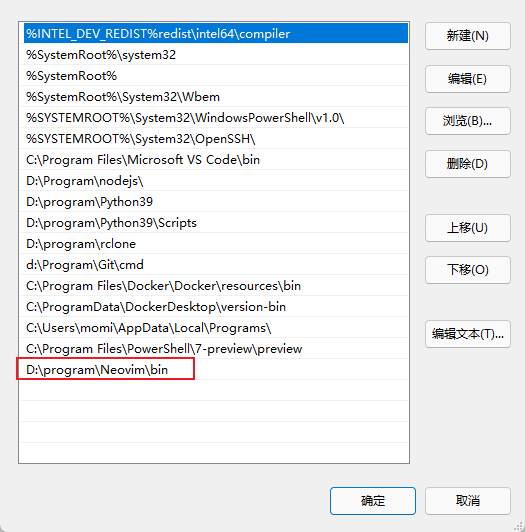
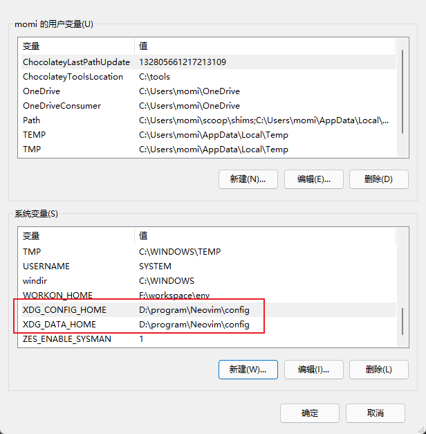
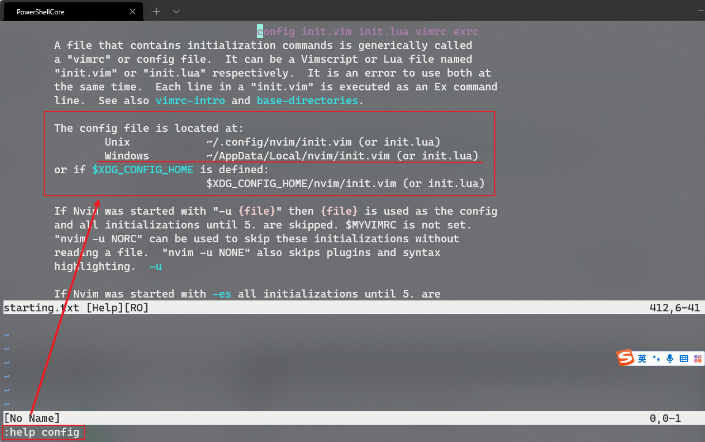
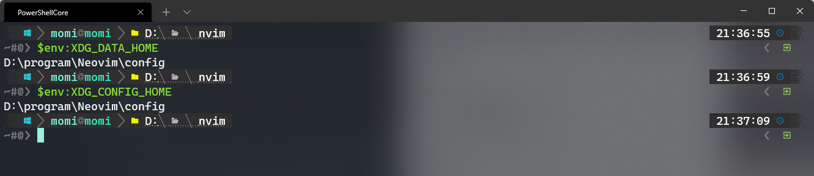

# Neovim 配置

## 准备工作

### 下载

下载地址：https://github.com/neovim/neovim/releases

### 环境变量

添加环境变量，方便在 cmd 命令行直接可以运行：



### neovim 变量

默认情况下 neovim 用的所有插件都会放到 c 盘，如果大家觉得 C 盘空间紧张，那么需要进行调整，比如放到 D 盘，可以按照下面方式操作：

默认 XDG_CONFIG_HOME，XDG_DATA_HOME 为空，会使用系统的 LOCALAPPDATA 变量作为配置文件的读取和插件的安装位置，默认都是在 c 盘的目录下，为了避免重装系统后 neovim 需要重配置的问题，我们将这两个位置调整一下，我们需要定义下面两个变量，路径可以根据自己的实际情况进行修改。

```bash
# 定义neovim配置文件的路径
XDG_CONFIG_HOME = D:\program\Neovim\config
# 定义插件等的路径
XDG_DATA_HOME = D:\program\Neovim\config
```



### 创建初始化文件

```bash
# 打开neovim
nvim
# 打开后输入直接输入下面的命令
:help config
```



在 windows 下默认的 neovim 的配置文件的路径在 `~/AppData/Local/nvim/init.vim`，上面我们定义了两个变量，配置文件放在自定义的路径下

```bash
# 在powershell下查看一下，下面的两个变量是否存在
$env:XDG_CONFIG_HOME
$env:XDG_DATA_HOME
```



## 插件安装

### vim-plug 插件管理器

在 powershell 下执行下面命令安装 vim-plug 脚本：

```bash
iwr -useb https://gitee.com/teachtea/vim-plug/raw/master/plug.vim |`
    ni "$(@($env:XDG_DATA_HOME, $env:LOCALAPPDATA)[$null -eq $env:XDG_DATA_HOME])/nvim-data/site/autoload/plug.vim" -Force
```

安装插件

```bash
# 要安装的插件包裹在 call plug#begin() 和 call plug#end() 中间
call plug#begin()
Plug 'neovim/nvim-lspconfig'
call plug#end()
```

常用命令

```bash
:PlugInstall
:PlugClean
:PlugStatus
```
