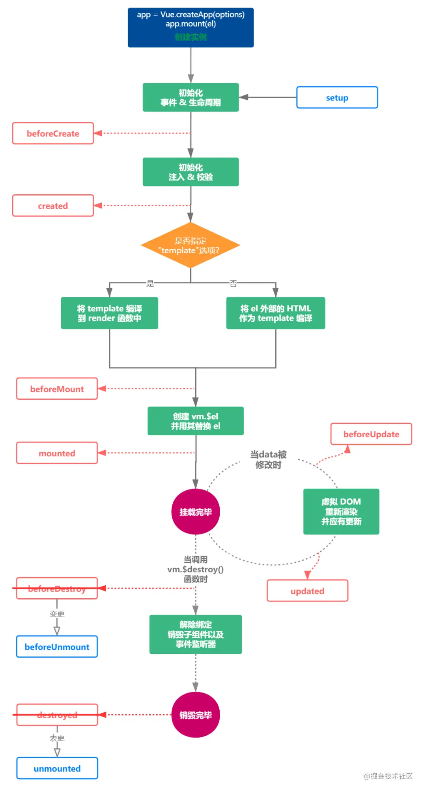
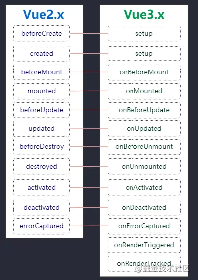

# Vue3

## Composition API

### setup

setup 是 Vue3.x 新增的一个选项， 他是组件内使用 `Composition API` 的入口

setup 执行时机是在 beforeCreate 之前执行

#### setup 参数

setup 接收两个参数

- props：组件传入的属性

- context

setup 中接收的 `props` 是响应式的， 当传入新的 props 时，会及时被更新，由于是响应式的， 所以不可以使用 ES6 解构，解构会消除它的响应式，错误示例

```js
// demo.vue
export default defineComponent ({
    setup(props, context) {
        const { name } = props
        console.log(name)
    },
})
```

由于 `setup` 中不能访问 Vue2 中最常用的 `this` 对象，所以 `context` 中就提供了 `this` 中最常用的三个属性：`attrs`、`slot` 和 `emit`，分别对应 Vue2.x 中的 `$attr` 属性、`slot` 插槽和 `$emit` 发射事件

### reactive、ref 与 toRefs

在 vue2.x 中， 定义数据都是在 `data` 中， 但是 Vue3.x 可以使用 `reactive` 和 `ref` 来进行数据定义

大致可认为 `reactive` 用于处理对象的双向绑定，`ref` 则处理基础类型的双向绑定

 `toRefs` 用于将一个 `reactive` 对象转化为属性全部为 `ref` 对象的普通对象，代码如下

```html
<template>
  <div class="homePage">
    <p>第 {{ year }} 年</p>
    <p>姓名： {{ nickname }}</p>
    <p>年龄： {{ age }}</p>
  </div>
</template>

<script>
import { defineComponent, reactive, ref, toRefs } from "vue";
export default defineComponent({
  setup() {
    const year = ref(0);
    const user = reactive({ nickname: "xiaofan", age: 26, gender: "女" });
    setInterval(() => {
      year.value++;
      user.age++;
    }, 1000);
    return {
      year,
      // 使用reRefs
      ...toRefs(user),
    };
  },
});
</script>
```

### 生命周期钩子



 `setup` 内部调用生命周期钩子（`beforeCreate` 和 `created` 被 `setup` 替换了，钩子命名都增加了 `on`）



> 注：使用前需要导入
>
> ```js
> import { defineComponent, onBeforeMount, onMounted, onBeforeUpdate,onUpdated,
> onBeforeUnmount, onUnmounted, onErrorCaptured, onRenderTracked,
> onRenderTriggered } from "vue"; 
> ```

### watch 与 watchEffect 的用法

watch 函数用来侦听特定的数据源，并在回调函数中执行副作用，默认情况是惰性的，也就是说仅在侦听的源数据变更时才执行回调

```js
watch(source, callback, [options])
```

- source：可以支持 string，Object，Function，Array；用于指定要侦听的响应式变量
- callback：执行的回调函数
- options：支持 deep、immediate 和 flush 选项

#### 侦听 reactive 定义的数据

```js
import { defineComponent, ref, reactive, toRefs, watch } from "vue";
export default defineComponent({
  setup() {
    const state = reactive({ nickname: "xiaofan", age: 20 });

    setTimeout(() => {
      state.age++;
    }, 1000);

    // 修改age值时会触发 watch的回调
    watch(
      () => state.age,
      (curAge, preAge) => {
        console.log("新值:", curAge, "老值:", preAge);
      }
    );

    return {
      ...toRefs(state),
    };
  },
});
```

#### 侦听 ref 定义的数据

```js
const year = ref(0);

setTimeout(() => {
  year.value++;
}, 1000);

watch(year, (newVal, oldVal) => {
  console.log("新值:", newVal, "老值:", oldVal);
});
```

#### 侦听多个数据

```js
watch([() => state.age, year], ([curAge, newVal], [preAge, oldVal]) => {
  console.log("新值:", curAge, "老值:", preAge);
  console.log("新值:", newVal, "老值:", oldVal);
});
```

#### 侦听复杂的嵌套对象

```js
const state = reactive({
  room: {
    id: 100,
    attrs: {
      size: "140平方米",
      type: "三室两厅",
    },
  },
});
watch(
  () => state.room,
  (newType, oldType) => {
    console.log("新值:", newType, "老值:", oldType);
  },
  { deep: true }
);
```

如果不使用第三个参数 `deep:true`， 是无法监听到数据变化的

默认情况下，watch 是惰性的，给第三个参数中设置 `immediate: true`，变为不是惰性的，可以立即执行回调函数

#### stop 停止监听

我们在组件中创建的 `watch` 监听，会在组件被销毁时自动停止，如果在组件销毁之前我们想要停止掉某个监听， 可以调用 `watch()` 函数的返回值

```js
const stopWatchRoom = watch(() => state.room, (newType, oldType) => {
    console.log("新值:", newType, "老值:", oldType);
}, {deep:true});

setTimeout(()=>{
    // 停止监听
    stopWatchRoom()
}, 3000)
```

#### watchEffect

```js
import { defineComponent, ref, reactive, toRefs, watchEffect } from "vue";
export default defineComponent({
  setup() {
    const state = reactive({ nickname: "xiaofan", age: 20 });
    let year = ref(0)

    setInterval(() =>{
        state.age++
        year.value++
    },1000)

    watchEffect(() => {
        console.log(state);
        console.log(year);
      }
    );

    return {
        ...toRefs(state)
    }
  },
});
```

执行结果首先打印一次 `state` 和 `year` 值；然后每隔一秒，打印 `state` 和 `year` 值

并没有像 `watch` 一样需要先传入依赖，`watchEffect` 会自动收集依赖, 只要指定一个回调函数

`watchEffect` 无法获取到变化前的值， 只能获取变化后的值

## 自定义 Hooks

useCount.ts

```ts
import { ref, Ref, computed } from "vue";

type CountResultProps = {
  count: Ref<number>;
  multiple: Ref<number>;
  increase: (delta?: number) => void;
  decrease: (delta?: number) => void;
};

export default function useCount(initValue = 1): CountResultProps {
  const count = ref(initValue);

  const increase = (delta?: number): void => {
    if (typeof delta !== "undefined") {
      count.value += delta;
    } else {
      count.value += 1;
    }
  };
    
  const multiple = computed(() => count.value * 2);

  const decrease = (delta?: number): void => {
    if (typeof delta !== "undefined") {
      count.value -= delta;
    } else {
      count.value -= 1;
    }
  };

  return {
    count,
    multiple,
    increase,
    decrease,
  };
}
```

useCount.vue

```html
<template>
  <p>count: {{ count }}</p>
  <p>倍数： {{ multiple }}</p>
  <div>
    <button @click="increase()">加1</button>
    <button @click="decrease()">减1</button>
  </div>
</template>

<script lang="ts">
import useCount from "../hooks/useCount";
 setup() {
    const { count, multiple, increase, decrease } = useCount(10);
        return {
            count,
            multiple,
            increase,
            decrease,
        };
    },
</script>
```

## 简单对比 vue2.x 与 vue3.x 响应式

- `Object.defineProperty`只能劫持对象的属性， 而 Proxy 是直接代理对象

由于 `Object.defineProperty` 只能劫持对象属性，需要遍历对象的每一个属性，如果属性值也是对象，就需要递归进行深度遍历，但是 Proxy 直接代理对象， 不需要遍历操作

- `Object.defineProperty` 对新增属性需要手动进行 `Observe`

因为 `Object.defineProperty` 劫持的是对象的属性，所以新增属性时，需要重新遍历对象， 对其新增属性再次使用 `Object.defineProperty` 进行劫持，也就是 Vue2.x 中给数组和对象新增属性时，需要使用 `$set` 才能保证新增的属性也是响应式的， `$set` 内部也是通过调用 `Object.defineProperty` 去处理的

## Teleport

我们可以用 `<Teleport>` 包裹 `Dialog`，此时就建立了一个传送门，可以将 `Dialog` 渲染的内容传送到任何指定的地方

index.html

```html
<body>
  <div id="app"></div>
  <div id="dialog"></div>
</body>
```

Dialog.vue

```html
<template>
  <teleport to="#dialog">
    <div class="dialog">
      <div class="dialog_wrapper">
        <div class="dialog_header" v-if="title">
          <slot name="header">
            <span>{{ title }}</span>
          </slot>
        </div>
      </div>
      <div class="dialog_content">
        <slot></slot>
      </div>
      <div class="dialog_footer">
        <slot name="footer"></slot>
      </div>
    </div>
  </teleport>
</template>
```

Header.vue

```html
<div class="header">
    ...
    <navbar />
    <Dialog v-if="dialogVisible"></Dialog>
</div>
...
```

## Suspense

`Suspense` 提供两个 `template` slot，刚开始会渲染一个 fallback 状态下的内容， 直到到达某个条件后才会渲染 default 状态的正式内容

```html
<Suspense>
      <template #default>
          <async-component></async-component>
      </template>
      <template #fallback>
          <div>
              Loading...
          </div>
      </template>
</Suspense>
```

asyncComponent.vue

```html
<<template>
<div>
    <h4>这个是一个异步加载数据</h4>
    <p>用户名：{{user.nickname}}</p>
    <p>年龄：{{user.age}}</p>
</div>
</template>

<script>
import { defineComponent } from "vue"
import axios from "axios"
export default defineComponent({
    setup(){
        const rawData = await axios.get("http://xxx.xinp.cn/user")
        return {
            user: rawData.data
        }
    }
})
</script>
```

## 片段（Fragment）

在 Vue2.x 中， `template` 中只允许有一个根节点，而在 Vue3.x 中，你可以直接写多个根节点

```html
<template>
    <span></span>
    <span></span>
</template>
```

## 更好的 Tree-Shaking

Vue3.x 在考虑到 `tree-shaking` 的基础上重构了全局和内部 API，表现结果就是现在的全局 API 需要通过 `ES Module` 的引用方式进行具名引用，比如在 Vue2.x 中，我们要使用 `nextTick`

```js
// vue2.x
import Vue from "vue"

Vue.nextTick(()=>{
    ...
})
```

在 Vue3.x 中改写成这样

```js
import { nextTick } from "vue"

nextTick(() =>{
    ...
})
```

### 受影响的 API

- `Vue.nextTick`
- `Vue.observable`
- `Vue.version`
- `Vue.compile`
- `Vue.set`
- `Vue.delete`


## 参考文献

[Vue3.0 新特性以及使用经验总结 - 掘金](https://juejin.cn/post/6940454764421316644)

